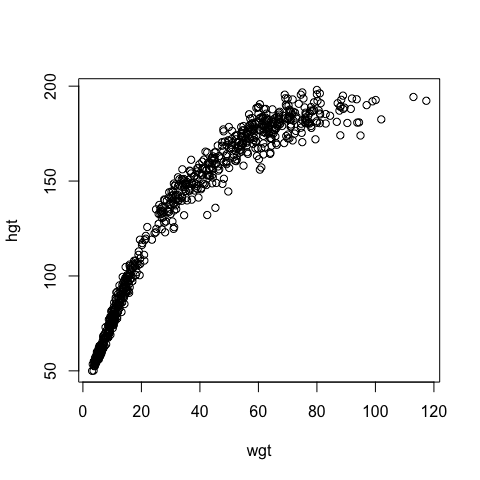
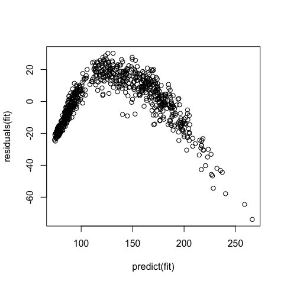

# Übung 5 - Testfragen zur schließenden Statistik
Florian Hartig  
7 Dec 2016  


# Hypothesentests

**Frage** Definieren Sie den p-Wert

**Antwort** p(d >= D | H0), in Worten: Wahrscheinlickhkeit die beobachteten oder extremere Daten zu bekommen wenn H0 wahr ist 


**Frage** Wie ist in der vorherigen Definition "extremer" (also >=) definiert?

**Antwort** Extremer bezieht sich auf die Teststatistik - diese ist ein Abstandsmaß dass der "Erfinder" des Testes wählt. Weil es hierfür unterschiedliche Möglichkeiten gibt gibt durchaus verschiedene Tests mit gleichen H0, aber anderen Teststatistiken

**Frage** Stellen Sie sich vor sie leben in Venedig, und es gibt 3 Taxibootfirmen. Sie wollen wissen ob es Unterschiede in der Beförderungsgeschwindigkeit gibt und machen deshalb 300 Farten mit jeder Firma und stoppen die Zeit. Was wäre eine geignete Nullhypothese H0 um auf einen Unterschied zu testen?

**Antwort** H0: Die durchschnittliche Zeit aller 3 Firmen ist gleich

**Frage** Bonusfrage: Nennen Sie eine der vielen möglichen sinnvollen Teststatistiken

**Antwort** Mögliche Antworten: Varian der 3 Mittelwerte, Unterschied größter / kleinster Mittelwert, Durchschnitt der Differenzen der Mittelwerte, ... [alles womit man die Firmen vergleichen könnte .. natürlich könnten Sie auch Mittewert durch Median ersetzen]

**Frage** In der Physik gibt es das sogenannte Standardmodell, dass die Eigenschaften und Interaktionen der Material beschreibt. In den letzten 20 Jahren wurde das Standardmodell immer und immer wieder getestet, so "erfolgreich" dass die Physiker schon ein bisschen deprimiert sind weil sie nichts neues entdecken. Was ist die Nullhypothese die bei diesen Tests angewandt wird?

**Antwort** H0 = das Standardmodell. 

Anmerkung: ich wollte Ihnen mit diesem Beispiel zeigen dass es 2 Möglichkeiten gibt Nullhypothesen aufzustellen

* Wenn wir einen Effekt bestätigen wollen, stellen wir die umgekehrte Nullhypothese auf, also dass es keinen Effekt gibt (das ist der Normalfall in der Analyse von biologischen Daten). Der Hintergrund hier ist dass wir einen Effekt vermuten, aber nicht sicher sind. 

* Wenn der Effekt / das Modell aber schon gut bekannt ist, d.h. es eine feste Theorie gibt, wäre das normale Vorgehen diesen Effekt / Theorie als H0 aufzustellen, und zu schauen ob es eine Abweichung von dem gibt was wir gerade als wahr ansehen. 


**Frage** Sie lesen einen Artikel über ein medizinisches Experiment. Getestet wurde ein Medikament gegen eine Kontrolle, und der p-Wert ist 0.03. Die Studie schreibt: "Die Wahrscheinlichkeit dass das Medikament nicht wirkt ist 3%" - stimmen Sie zu?

**Antwort** Nein, der p-Wert gibt die Wahrscheinlichkeit der Daten gegeben H0 an, nicht die Wahrscheinlichkeit von H0


**Frage** Schreiben Sie eine korrekte Interpretation des obigen Ergebnis auf

**Antwort** "Die Wahrscheinlichkeit dass die beobachteten Effekte oder stärker unter H0 (d.h. ohne Wirkung des Medikaments) auftreten ist 3%. Der Unterschied zwischen Kontrolle und Behandlung ist deshalb signifikant bei einen Signifikanzlevel von 5%."

**Frage** Definierent sie den Typ I Fehler (falschen positive)

**Antwort** Wahrscheinlichkeit dass der p-Wert signifikant wird wenn H0 wahr ist


**Frage** Wie viel Typ I Fehler erwarten Sie bei einen Signifikanzlevel von 7%

**Antwort** 7%


**Frage** Definieren Sie den Typ II Fehler (falsche negative)

**Antwort** Wahrscheinlichkeit dass der p-Wert nicht signifikant wird wenn H0 nicht wahr ist


**Frage** Wie viel Typ II Fehler erwarten Sie bei einen Signifikanzlevel von 7%

**Antwort** Nur mit dieser Information kann man das nicht sagen, weil der Typ II von mehreren Faktoren abhängt. 

**Frage** Nennen Sie 2 Faktoren die Typ II Fehler beeinflussen, und die Richtung des Einflusses (negativ = Typ II nimmt ab wenn Faktor hoch geht)

**Antwort** Mögliche Antworten: Sigifikanzlevel - negativ; Varianz - positiv; Effektstärke: negativ; power / Stichprobengröße: negativ


**Frage** Definieren Sie die Teststärke / Power

**Antwort** power = 1 - Typ I Fehler / in Worten: also Wahrscheinlichkeit dass der p-Wert signifikant wird wenn H0 nicht wahr ist


**Frage** Sie testen 100 Gene auf eine Assoziation mit Krebs. Bei 5 Genen zeigt der Test Signifikanz an. Wie bewerten Sie dieses Ergebnis?

**Antwort** 5 von 100 signifikante Tests sind zu erwarten wenn keines der Gene eine Wirkung hat (wir machen hier multiples Testen). Das Ergebnis zeigt keine besondere Evidenz für einen Effekt an. 

Bemerkung: Trotzdem würde man natürlich die 5 signifikanten mit einen weiteren Experiment noch mal nachtesten, man weiß ja nie. Aber statistisch ist so ein Ergebnis zu erwarten, auch wenn keines der Gene eine Wirkung hat.

**Frage** Sie bekommen von einer allwissenden Macht die Zusatzinformation dass Sie in dem oben genannten Test eine Teststärke von 99% hatte. Sind Sie nun zuversichtlicher dass Sie einen Effekt gefunden haben?

**Antwort** Nein, denn wenn Ihre Teststärke fast 100% ist und Sie wirklich Assoziationen in den Datensatz hätten dann müssten Sie ja trotzdem MEHR als 5% positive sehen.


**Frage** Definieren Sie die False Discovery Rate (FDR)

**Antwort** Die Rate an Experimenten die Signifikanz anzeigt obwohl kein Effekt da ist wenn man viele Experimente macht.

**Frage** Wovon hängt die FDR ab?

**Antwort** FDR hängt ab von Typ I und II Fehlerrate und der Wahrscheinlichkeit dass H0 wahr ist (bzw. dass die in den Experimente getesteten Effekt da sind). 

**Frage** In einer Reihe von Experimenten testen Sie Medikamente auf eine Wirkung. Ihre Power ist 100%. Sie schätzen dass jedes 20. Medikament das Sie testen eine Wirkung haben solte. Wie ist ihre FDR bei einem Signifikanzlevel von 5%? Es reicht wenn Sie den Rechenweg aufschreiben, Sie müssen den Wert nicht ausrechnen. 

**Antwort** 0.95 * 0.05 / (0.95 * 0.05 + 0.05 * 1) - Rate an Typ I / Rate an signifikante Ergebnissen


# MLE

**Frage**: Wie ist die Likelihood der beobachteten Daten D für ein gegebenes Modell M mit Parameter x definiert?

**Antwort**: p(D|M,x) - in Worten: die Wahrscheinlichkeits(dichte) für D, gegeben M und x


**Frage**: In einem Experiment wurde der Effekt von Stickstoff auf das Wachstum von Pflanzen getestet - der Likelihood ist maximal für eine Verdoppelung des Wachstums. Die Autoren schreiben: "Die Wahrscheinlichkeit die beobachteten Daten zu erhalten ist maximal wenn man annimmt dass Stickstoff das Wachstum von den beobachteten Pflanzen verdoppelt" - ist diese Aussage Korrekt

**Antwort**: Ja


**Frage**: Weiter unten schreiben die Autoren: "Der wahrscheinlichste Wert für den Effekt von Stickstoff ist 2 (verdoppelung)" - ist diese Aussage korrekt?

**Antwort**: Nein. Der MLE gibt den Wert für den die Wahrscheinlichkeit der Daten maximual ist. Um die Aussage umzudrehen müssen wir Zusatzannahmen machen (alle Parameter gleich wahrscheinlich). 


# Regression

**Frage** Was sind die Annahmen der linearen Regression

**Antwort** Abh. Variable beschreibbar durch Polynom der unabhängigen Variable(n) + normalverteilte Streuung

**Frage** Wie werden die Parameter in der linearen Regression bestimmt?

**Antwort** Man sucht den MLE für die Annnahmen der linearen Regresion

**Frage** Welche H0 steckt hinter den p-Werten der Parameter der linearen Regression?

**Antwort** H0 = Parameter ist 0

**Frage** Wir interessieren uns für den folgenden Zusammenang zwischen Körpergröße (hgt) und Gewicht (wgt) aus einem Datensatz holländischer männlicher Kinder / Jugendlicher

<!-- -->

interpretieren Sie die folgenden Regressiontabelle


```r
fit = lm(hgt ~ wgt, data = mice::boys, na.action = "na.exclude")
summary(fit)
```

```
## 
## Call:
## lm(formula = hgt ~ wgt, data = mice::boys, na.action = "na.exclude")
## 
## Residuals:
##     Min      1Q  Median      3Q     Max 
## -73.926 -11.639   1.329  12.532  30.231 
## 
## Coefficients:
##             Estimate Std. Error t value Pr(>|t|)    
## (Intercept) 68.79024    1.01156   68.00   <2e-16 ***
## wgt          1.68173    0.02207   76.22   <2e-16 ***
## ---
## Signif. codes:  0 '***' 0.001 '**' 0.01 '*' 0.05 '.' 0.1 ' ' 1
## 
## Residual standard error: 15.49 on 725 degrees of freedom
##   (21 observations deleted due to missingness)
## Multiple R-squared:  0.889,	Adjusted R-squared:  0.8889 
## F-statistic:  5809 on 1 and 725 DF,  p-value: < 2.2e-16
```

**Antwort** Gefittet wurde ein lineare Zusammenhang: hgt = a0 + a1 * wgt Der MLE für den Zusammehang ist a0 = 68.79024, a1 = 1.68173. Körpergröße steigt also an mit dem Gewicht an Für beide Werte kann die Nullhypothese (Parameter ist 0) mit hoher Signifikanz abgelehnt werden p<0.0000000000000002

**Frage** Die Residuen des Models, geplottet gegen den vorhergesagten Wert (Körpergröße) sehen so aus 


```r
plot(residuals(fit) ~ predict(fit))
```

<!-- -->

ist ein solcher Plot akzeptabel?

**Antwort** Nein. Es gibt ein klares Pattern: für kleine und große Vorhersagen sind die Residuen systematisch negativ, d.h. das Modell überschätzt die Daten. Für mittlere Vorhersagen sind die Residuen systematisch positiv, d.h. das Modell unterschätzt die Daten.

**Frage** Können Sie sich denken was das Problem ist?

**Antwort** Wie man an dem Plot sieht ist der Effekt nicht linear - man hätte die Variablen transformieren oder einen quadratische Term in das Modell aufnehmen müssen.

# Multiple Regression, Störfaktoren, etc.

**Frage** Bzgl. der oben durchgeführten Analyse: welcher der drei Variablen ist der wichtigste Störfaktor: Alter, Sportlichkeit, Geburtsort

**Antwort** Alter, denn es ist zu erwarten dass Alter einen großen Einfluss auf Gewicht (erklärende Variable) und Körpergröße (abhängige Variable) hat

**Frage** Wie kann man den Effekt von Alter und Gewicht trennen

**Antwort** Multiple Regression

**Frage** Wenn wir jetzt eine multiple Regression machen, erwarten Sie dass der Effekt von Gewicht hoch oder runtergeht (in bezug auf die Regression nur mit Gewicht)?

**Antwort** Runter. Störfaktor Alter hängt positiv mit Gewicht (erklärende Variable) und Körpergröße (abhängige Variable) zusammen, also geht der Effekt von Gewicht hoch wenn der Störfaktor fehlt, und runter wenn wir Alter reinnehmen. Schauen wir uns das mal an?


```r
fit = lm(hgt ~ wgt + age, data = mice::boys, na.action = "na.exclude")
summary(fit)
```

```
## 
## Call:
## lm(formula = hgt ~ wgt + age, data = mice::boys, na.action = "na.exclude")
## 
## Residuals:
##     Min      1Q  Median      3Q     Max 
## -30.367  -6.822   1.293   7.527  26.441 
## 
## Coefficients:
##             Estimate Std. Error t value Pr(>|t|)    
## (Intercept) 69.48387    0.65230 106.521  < 2e-16 ***
## wgt          0.30576    0.04534   6.743 3.16e-11 ***
## age          5.48958    0.17177  31.960  < 2e-16 ***
## ---
## Signif. codes:  0 '***' 0.001 '**' 0.01 '*' 0.05 '.' 0.1 ' ' 1
## 
## Residual standard error: 9.981 on 724 degrees of freedom
##   (21 observations deleted due to missingness)
## Multiple R-squared:  0.954,	Adjusted R-squared:  0.9538 
## F-statistic:  7503 on 2 and 724 DF,  p-value: < 2.2e-16
```

**Frage** Wie stark hat sich der Effekt von Gewicht durch das Einbeziehen des Störfaktors geändert

**Antwort** Vorher 1.68, jetzt 0.3 -> d.h. der wahre Effekt ist nur ca. 20% des ursprünglichen Effekts, Körpergröße hängt vor allem am Alter und nicht am Gewicht
 
**Frage** Sie erhalten einen großen Datensatz mit allen möglichen Eigenschaften von Personen und der Information ob eine Krebserkrankung vorliegt oder nicht. Die Frage ist ob der Konsum von Fleisch zu einer höheren Wahrscheinlichkeit von Krebs führt. Nennen Sie 2 mögliche Störfaktoren die man bei der Analyse dieses Datensatzes beachten sollte. Geben Sie eine Begründung für jeden Falktor

**Antwort** 

* Alter - korreliert mit Krebs und potentiell mit Fleischkonsum (junge Leute mit größerer Wahrscheinlichkeit Vegetarier)
* Geschlecht - korreliert auf jeden Fall mit Fleischkonsum und potentiell mit Krebs (je nach Krebsart)

Bei einer solchen Frage ist wichtig dass Sie glaubhaft darstellen dass der Störfaktor mit beiden Variable (erkl. u. abh.) korreliert. Eine falsche Antwort wäre z.B. genetische Disposition - die hat zwar klar einen Einfluss auf den Krebs, aber es ist nicht klar warum diese mit Fleischkonsum korrelieren sollte 


