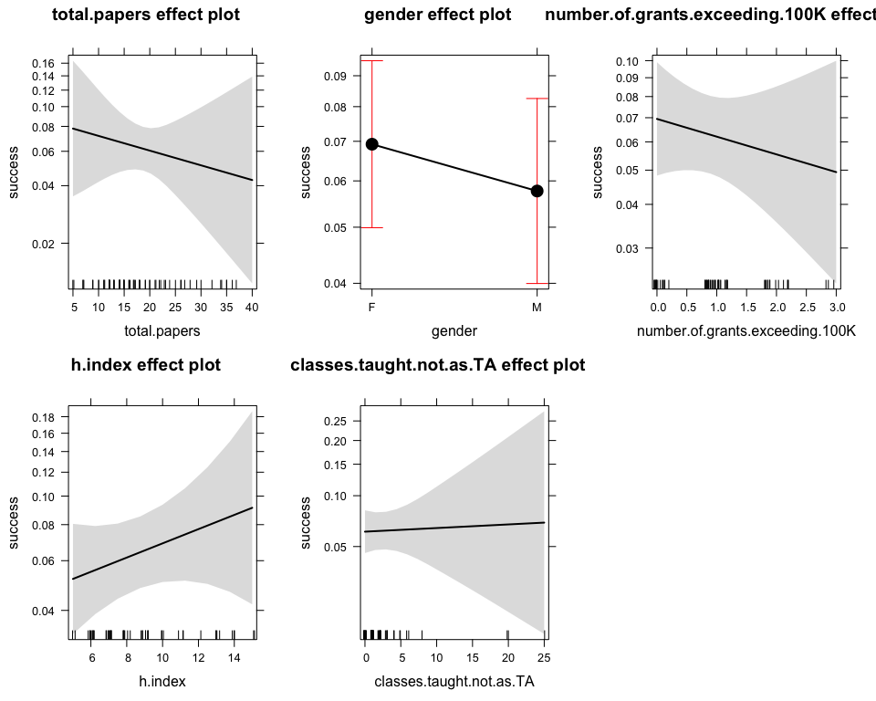

# Job Applications
Florian Hartig  
4 Jan 2017  

Problem / data from https://dynamicecology.wordpress.com/2017/01/04/you-cant-tell-much-about-your-odds-of-getting-an-interview-for-a-faculty-position-from-common-quantitative-metrics/

## Reading in data 


```r
set.seed(123)
jobApplications <- read.csv2("jobApplications.csv")
str(jobApplications)
```

```
## 'data.frame':	72 obs. of  20 variables:
##  $ applicant.id                    : int  1 2 3 4 5 6 7 8 9 10 ...
##  $ area.of.specialization          : Factor w/ 52 levels "Applied behavioural ecology/conservation",..: 14 3 8 28 39 17 1 10 19 20 ...
##  $ current.position                : Factor w/ 20 levels "adjunct research faculty",..: 12 10 14 14 14 1 14 14 18 11 ...
##  $ PhD.year                        : int  2016 2016 2012 2015 2013 2010 2014 2014 2007 2017 ...
##  $ years.in.postdoc                : num  0.5 0.5 4 1 3 5 2 2 9 0 ...
##  $ first.authored.papers           : int  13 7 18 8 9 11 7 7 29 9 ...
##  $ total.papers                    : int  18 18 24 15 17 14 9 16 42 19 ...
##  $ h.index                         : int  7 8 10 5 7 8 4 6 13 9 ...
##  $ number.of.grants.exceeding.100K : int  0 1 1 2 2 0 3 1 1 2 ...
##  $ classes.taught.not.as.TA        : int  2 1 2 1 1 1 1 1 2 3 ...
##  $ gender                          : Factor w/ 2 levels "F","M": 2 2 1 2 2 2 1 1 2 2 ...
##  $ ethnicity                       : Factor w/ 4 levels "Asian","Hispanic",..: 4 4 4 4 4 NA 4 4 4 4 ...
##  $ number.of.applications          : int  10 14 35 6 28 12 7 30 NA NA ...
##  $ number.of.phone.skype.interviews: int  1 1 2 1 2 0 1 1 0 0 ...
##  $ number.of.on.campus.interviews  : int  0 0 2 1 1 0 1 1 0 0 ...
##  $ X                               : logi  NA NA NA NA NA NA ...
##  $ X.1                             : logi  NA NA NA NA NA NA ...
##  $ X.2                             : logi  NA NA NA NA NA NA ...
##  $ X.3                             : logi  NA NA NA NA NA NA ...
##  $ X.4                             : logi  NA NA NA NA NA NA ...
```


## Preparing data


```r
# using MICE data imputation because of the many NAs in the number.of.applications 
library(mice)
jobApplications$number.of.applicationsI = complete(mice(jobApplications[,13:15], m = 10, print=FALSE))[,1] 

# I didn't impute the predictors for worry that this could bias the analysis, so checking here for complete cases
comp = complete.cases(jobApplications[,c("gender", "number.of.grants.exceeding.100K", "h.index", "classes.taught.not.as.TA")])


# preparing data for proportional glm (R convention is success / failure)
jobApplications$success = cbind(jobApplications$number.of.phone.skype.interviews, jobApplications$number.of.applicationsI - jobApplications$number.of.phone.skype.interviews)
```

## Analysis

### Fitting model


```r
m1 = glm(success ~ total.papers + gender + number.of.grants.exceeding.100K + h.index + classes.taught.not.as.TA, family = binomial,  data = jobApplications[comp,] , na.action = "na.exclude")
```

### Checking of model is appropriate


```r
library(DHARMa)
plot(simulateResiduals(m1, n = 1000))
```

<!-- -->

Looks all right. 

### Summary and plots


```r
summary(m1)
```

```
## 
## Call:
## glm(formula = success ~ total.papers + gender + number.of.grants.exceeding.100K + 
##     h.index + classes.taught.not.as.TA, family = binomial, data = jobApplications[comp, 
##     ], na.action = "na.exclude")
## 
## Deviance Residuals: 
##     Min       1Q   Median       3Q      Max  
## -2.1824  -0.9261  -0.5290   0.3155   2.4439  
## 
## Coefficients:
##                                  Estimate Std. Error z value Pr(>|z|)    
## (Intercept)                     -2.661550   0.351449  -7.573 3.64e-14 ***
## total.papers                    -0.018251   0.029947  -0.609    0.542    
## genderM                         -0.194894   0.264813  -0.736    0.462    
## number.of.grants.exceeding.100K -0.121025   0.169290  -0.715    0.475    
## h.index                          0.061018   0.059922   1.018    0.309    
## classes.taught.not.as.TA         0.005318   0.036337   0.146    0.884    
## ---
## Signif. codes:  0 '***' 0.001 '**' 0.01 '*' 0.05 '.' 0.1 ' ' 1
## 
## (Dispersion parameter for binomial family taken to be 1)
## 
##     Null deviance: 74.365  on 66  degrees of freedom
## Residual deviance: 71.748  on 61  degrees of freedom
## AIC: 155.19
## 
## Number of Fisher Scoring iterations: 5
```

```r
library(effects)
plot(allEffects(m1))
```

<!-- -->
