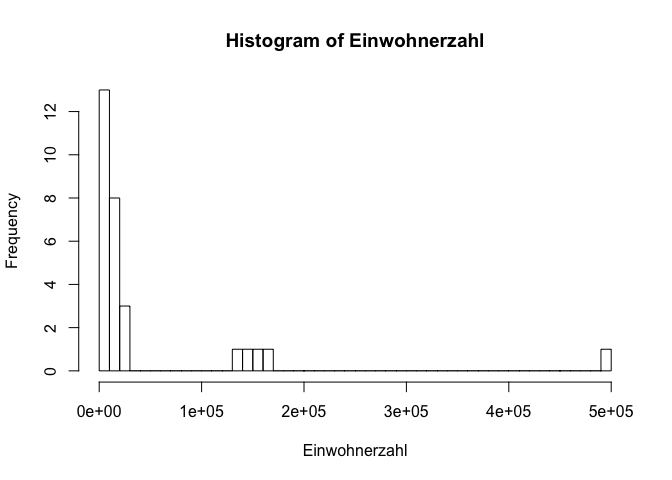
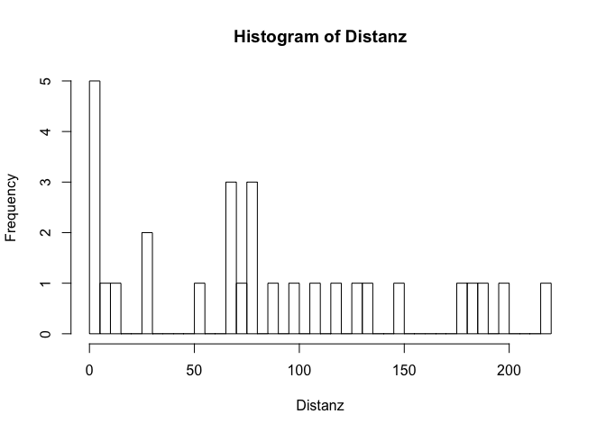
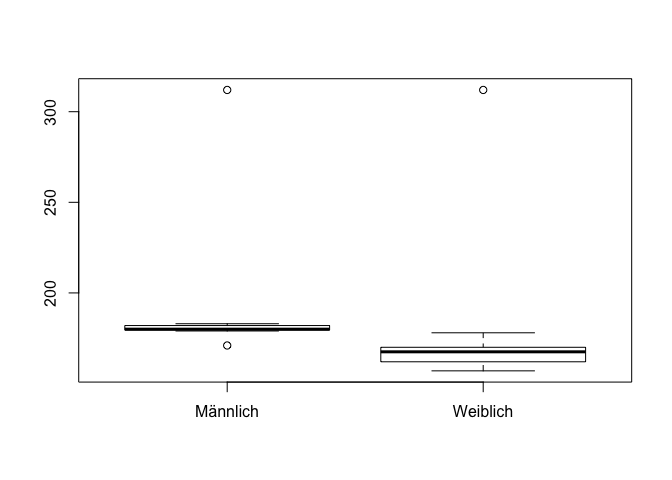
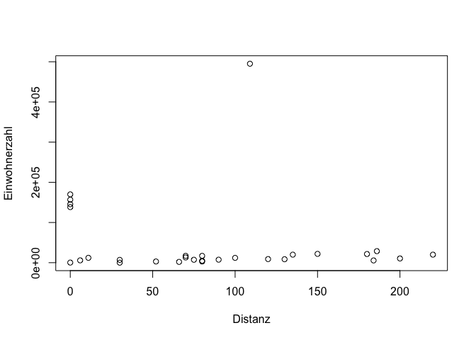

# Biostatistik - Übung zu Vorlesung 1
Florian Hartig  
10 Nov 2016  

## Daten einlesen und prüfen

Also, als erstes lesen wir die Daten ein. Das geht mit der read.delim Funktion. Wenn Sie das zu Hause ausprobieren wollen müssen Sie natürlich den Pfad ändern


```r
Daten <- read.delim("~/Home/Teaching/Vorlesungen/Statistik/Vorlesungen/16-11-Biostatistik/Biostatistik Vorlesung.csv", na.strings = "")
```

Sie können Daten aber auch über den Reiter "Environment" im Fenster rechts oben, und dan "Import Dataset" einlesen. 

Übrigens, die read.delim Funktion ist eine Hilfsfunktion mit einigen Voreinstellungen für die allgemeine Funktion "read.table". Sie können sich die Voreinstellungen anschauen wenn sie die Hilfe aufrufen. Das geht entweder über 


```r
?read.delim
```

oder mit der Maus den Cursor auf die Funktion setzen, und dann F1 drücken. 

Bemerkung: diese und weitere technischen Kommentare zu Details der Sprache R sind nicht klausurrelevant. Ich möchte nur dass Sie verstehen was wir hier machen. 

Die Daten sind jetzt in R als Tabelle die den Namen "Daten" hat. Als erstes sollten wir überprüfen ob R auch den Typ der Variable korrekt erkannt hat. Das geht über den str() Befehl (steht für structure, struktur)


```r
str(Daten)
```

```
## 'data.frame':	30 obs. of  8 variables:
##  $ Einwohnerzahl: int  12000 28708 5800 8600 20000 9000 NA 495121 10500 2955 ...
##  $ Distanz      : int  100 186 6 130 135 120 NA 109 200 80 ...
##  $ Körpergröße  : int  167 178 174 180 171 179 3 181 160 162 ...
##  $ Augenfarbe   : Factor w/ 3 levels "Blau","Braun",..: 1 3 2 3 1 3 NA 1 2 1 ...
##  $ Transport    : Factor w/ 4 levels "Auto","Bus","Fahrad",..: 4 2 2 2 3 2 NA 2 2 2 ...
##  $ Geschlecht   : Factor w/ 2 levels "Männlich","Weiblich": 2 2 2 1 1 1 NA 1 2 2 ...
##  $ Studium      : Factor w/ 3 levels "Leicht","Mittel",..: 3 3 3 1 3 2 NA 2 3 3 ...
##  $ Statistik    : Factor w/ 3 levels "mehr als mehr als sehr",..: 3 3 1 3 3 1 NA 3 3 3 ...
```

Sie sehen dass die Daten aus 30 Beobachtungen von 8 Variablen bestehen. 

Bei den numerischen Variable steht "int". Das ist OK, und bedeutet dass die Variable integer, also ganzzahlig sind. Bei den kategorialen Variablen steht "Factor" - auch das ist korrekt. Das ist der R Name für kategoriale Variablen.

Bei den kategorialen Daten werden Ihnen auch gleich die Kategorien angezeigt. Es lohnt sich hier zu schauen ob das korrekt ist. Oft gibt es in Datensätzen Rechtschreibfehler, so dass Kategorien nicht richtig zugeordnet werden. 


## Deskriptive Statistiken

Man kann sich eine Zusammenfassung der Daten anzeigen lassen über


```r
summary(Daten)
```

```
##  Einwohnerzahl       Distanz        Körpergröße    Augenfarbe  Transport 
##  Min.   :     4   Min.   :  0.00   Min.   :  3.0   Blau :14   Auto  :10  
##  1st Qu.:  5800   1st Qu.: 30.00   1st Qu.:162.8   Braun: 7   Bus   :17  
##  Median : 12000   Median : 80.00   Median :168.0   Grün : 8   Fahrad: 1  
##  Mean   : 47016   Mean   : 84.62   Mean   :173.5   NA's : 1   Zu Fuß: 1  
##  3rd Qu.: 21574   3rd Qu.:130.00   3rd Qu.:177.5              NA's  : 1  
##  Max.   :495121   Max.   :220.00   Max.   :312.0                         
##  NA's   :1        NA's   :1                                              
##     Geschlecht   Studium                    Statistik 
##  Männlich: 7   Leicht: 1   mehr als mehr als sehr: 3  
##  Weiblich:22   Mittel:16   mehr als sehr         : 3  
##  NA's    : 1   Schwer:12   sehr                  :23  
##                NA's  : 1   NA's                  : 1  
##                                                       
##                                                       
## 
```

Diese Funktion zeigt für jede Spalte im Datensatz die folgenden Informationen an:

* Numerische Variablen
 * min / max
 * 1. und 3. Quartil (25% und 75% Quantil)
 * Mittelwert
 * Median
 * NA's
 
* Kategoriale Variablen
 * Häufigkeit  
 
NA heißt dass hier keine Information verfügbar ist, also eine fehlende Messung. Das tritt in fast jedem Datensatz auf. Es lohnt sich ein Auge auf die Anzahl von NAs zu haben weil das für eine spätere Analyse wichtig ist. 
 
Auf die einzelnen Spalten (Variablen) des Datensatzes kann man mit 


```
##  [1]  12000  28708   5800   8600  20000   9000     NA 495121  10500   2955
## [11] 156886   2000      4   3000   4883  12072 145465  13000  17000  17000
## [21]  21908   7500    300   5600  20000   7300 138296  21574   7000 170000
```

zugreifen. Weil das aber etwas lästig ist gibt es den Befehl


```r
attach(Daten)
```

der alle Spalten direkt im "Workspace verfügbar macht". D.h. nach diesem Befehl kann man direkt


```
##  [1]  12000  28708   5800   8600  20000   9000     NA 495121  10500   2955
## [11] 156886   2000      4   3000   4883  12072 145465  13000  17000  17000
## [21]  21908   7500    300   5600  20000   7300 138296  21574   7000 170000
```

schreiben um auf die Einwohnerzahl zuzugreifen. Dann schauen wir uns die Einwohnerzahl doch mal an. Schauen Sie noch mal auf die Übersicht oben - ausgehend von den Quartilen, Mittelwert und Median, was würden Sie für eine Verteilung erwarten?

Hoffentlich haben Sie gesehen dass die Abstände von 1st, 2. (Median) und 3. Quartil größer werden. Außerdem ist der Mittelwert viel größer als der Median. All dies deutet auf eine rechtsschiefe Verteilung hin. 

Dann schauen wir mal 


```r
hist(Einwohnerzahl, breaks = 50)
```

<!-- -->

Also, wir haben eine starke Häufung von kleinere Orten, und nur wenige große Städte die die Verteilung nach rechts ziehen. Vielleicht sollten wir die rechtsschiefe aber noch mal formal ausrechen. Also, wie war das, sollte die Schiefe jetzt postiv oder negativ sein?

Genau, es sollte positiv sein. Dann schauen wir mal. 


```r
library(moments)
skewness(Einwohnerzahl, na.rm = T)
```

```
## [1] 3.420357
```

Bemerkungen: 1) R hat viele Befehle die nicht standardmäßig aktiviert sind, sondern die durch das Laden einer Biliothekt aktiviert werden müssen. Dies geschieht durch den library Befehl. 2) das na.rm = T sagt dem Befehl dass die NAs ignoriert werden sollen. 

Wie sieht es denn mit der Distanz zu Regensburg aus?

Hier würde ich sagen es ist nicht so eindeutig wenn man sich die Quartile anschaut. Man könnte eventuell eine leichte rechtsschiefe erwarten, aus ähnlichen Gründen wie oben, aber es ist weniger klar. 

Dann schauen wir noch mal auf die Verteilung


```r
hist(Distanz, breaks = 50)
```

<!-- -->

Ja, es sieht ganz leicht rechtsschief aus. Überprüfen wir das auch noch mal numerisch


```r
skewness(Distanz, na.rm = T)
```

```
## [1] 0.3775853
```


Vielleicht ist es an dieser Stelle ja mal Instruktiv alle Statistiken die wir hatten an diesem Beispiel zu berechnen


```r
Mittelwert = mean(Distanz, na.rm = T)
Median = median(Distanz, na.rm = T)
Maximum = max(Distanz, na.rm = T)
Minimum = min(Distanz, na.rm = T)
Quantile = quantile(Distanz, na.rm = T)
Varianz = var(Distanz, na.rm = T)
Standardabweichung = sd(Distanz, na.rm = T)
Schiefe = skewness(Distanz, na.rm = T)
Wölbung = kurtosis(Distanz, na.rm = T)
```

Plotten wir doch noch mal die Quartile auf die Verteilung


```r
hist(Distanz, breaks = 50)
abline(v = Quantile, col = "red", lwd = 2)
```

<!-- -->

Sie sehen dass die Abstände der Quartile weiter werden nach rechts. Das zeigt die Rechtsschiefe an. 

Übrigens, haben Sie gemerkt dass das 0-Quantil ein anderes Wort für das Minimum ist?

Noch ein Kommentar zur Wölbung. Die Wölbung einer Normalverteilung ist 3. Deshabl wird manchmal statt der eigentlichen Wölbung der Exzess (Unterschied zur Normalverteilung) angegeben. Unsere Wölbung is 


```r
Wölbung
```

```
## [1] 2.101254
```

Also ist der Excess 


```r
Wölbung - 3
```

```
## [1] -0.8987462
```

D.h. die Verteilung der Distanzen ist "flacher" als bei einer Normalverteilung. 

Wo wir gerade von Normalverteilungen reden - kennen Sie die Normalverteilung? Die Formel für die Normalverteilung ist 

1/(2*Pi*sd) * exp(- (x - mean)^2 / (2*sd^2 )

Graphisch sieht das so aus. Das interessante an der Formel für die Normalverteilung ist dass die Parameter der Verteilung auch direkt dem Mittelwert und der Standardabweichung entsprechen


```r
curve(dnorm(x), -5,5)
abline(v = c(0))
lines(x = c(-1,1), y = dnorm(c(-1,1)), col = "red", lwd = 2)
lines(x = c(-2,2), y = dnorm(c(-2,2)), col = "red", lwd = 2)
```

<!-- -->

Mit den roten Linien habe ich den bereich von 1 und 2 Standardabweichungen vom Mittelwert eingezeichnet. 63% der Daten liegen +/- 1 Standardabweichung vom Mittelwert.

Ich glaube wir haben die numerischen Daten genügend behandelt. Schauen wir uns zuletzt noch mal die kategorischen Daten an. 

In R kann man sich eine Tabelle über den table Befehl ausgeben lassen. 


```r
table(Transport)
```

```
## Transport
##   Auto    Bus Fahrad Zu Fuß 
##     10     17      1      1
```

Das ist jetzt nicht so spektakulär schwierig zu interpretieren. Schauen wir uns das doch gleich mal optisch an. 


```r
oldpar <- par(mfrow = c(2,2))
plot(Transport, las = 2)
plot(Augenfarbe, las = 2)
plot(Geschlecht, las = 2)
plot(Studium, las = 2)
```

<!-- -->

```r
par(oldpar)
```

Ausblick auf nächste Woche ... natürlich liegt es jetzt auf der Hand mal zu schauen ob es Abhängigkeiten zwischen bestimmten Variablen gibt. Zum Beispiel könnten wir uns anschauen ob es eine Abhängigkeit zwischen der Körpergröße und dem Vergehrsmittel gibt. 


```r
boxplot(Körpergröße ~ Geschlecht)
```

<!-- -->

Hier geht die Achse aber nicht bei 0 los ... das kann verwirrend sein. So noch mal anders.


```r
boxplot(Körpergröße ~ Geschlecht, ylim = c(0,350))
```

<!-- -->

Sind denn größere Menschen vielleicht auch mehr mit den Fahrad unterwegs?


```r
boxplot(Körpergröße ~ Transport)
```

<!-- -->

Da kann man so nicht viel sehen. Vielleicht als letztes noch mal 


```r
plot(Distanz, Einwohnerzahl)
```

<!-- -->

Noch eine Bemerkung für die MSc Arbeit:

* Grafiken sollten Sie exportieren als pdf, nicht png oder tiff (weil Vektorgrafik, höhere Qualität und kleine Größe)
* Kann dann auch mit Illustrator (kommerziell) oder Inkscape nachbearbeitet werden. 


```r
detach(Daten)
```

